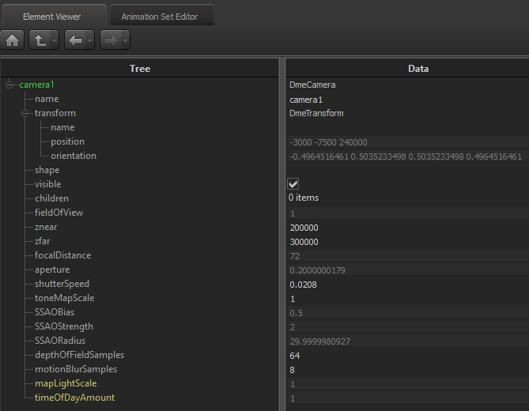
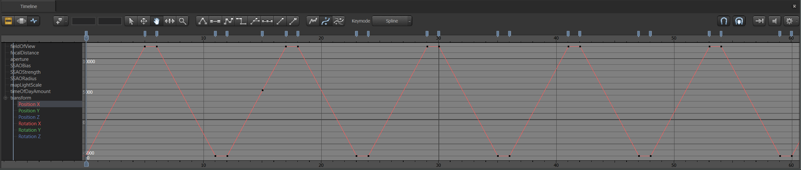
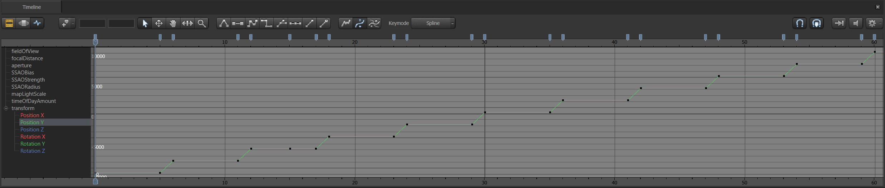
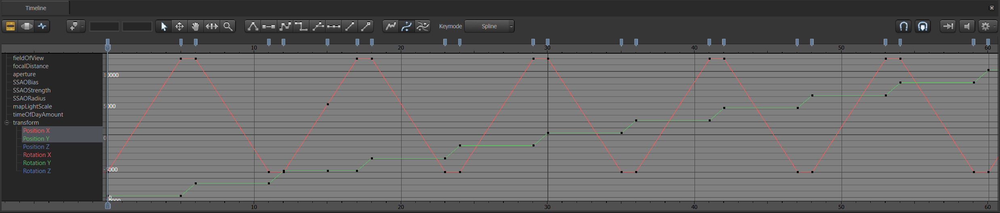
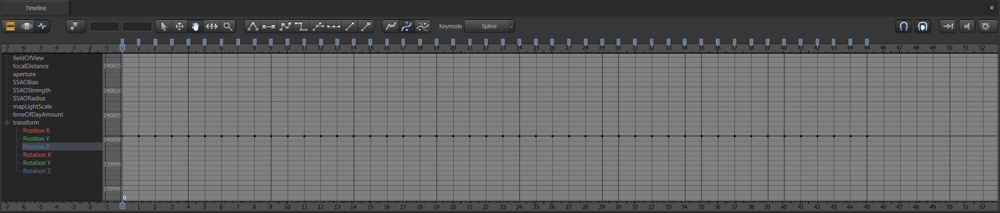
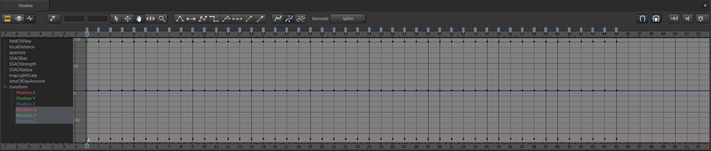

# Generating Map Image

[Original instruction by Devilesk](https://devilesk.com/blog/creating-a-dota-map-image)

The way to go is generating a series of map shots using Dota 2 Tools, specifically SFM, moving in serpentine motion across the map.

My preset SFM session is based on one provided by Devilesk originally. It's a 66 seconds long movie with the camera panning over the dota map. It starts in the bottom left corner and ends up in the top right corner moving in a snake-like pattern. The camera distance is set to a very large value and the field of view is set to 1.

Here’s the camera prop values set in the element viewer.



Here’s some views of the Graph Editor timeline which describe the movement of the camera.



The camera X position goes from -6000 to 12000 over 6 seconds which represents one left to right sweep over the map.



The Y position remains constant during this time. Then the X position stays constant for 1 second while the Y position increases. This sets up for the next row.

The X position then moves in the opposite direction from 12000 to -6000 over 5 seconds, which makes a right to left sweep over the map. Then the X position stays constant for another 1 second while the Y position goes up to start another row like before. This pattern is repeated until the whole map is covered.



The Z position and XYZ rotation are constant.





Here’s an example movie demonstrating the camera movement.

To get the images necessary to form the dota map image, the movie is exported as pngs with a resolution of 3840x2160 at 1 FPS. Since the camera movement is set to take 5 seconds for one horizontal pass over the map that results in 6 frames per row. There’s 9 rows so that’s 66 images in total which come together in a 6x11 grid to form a complete image of the dota map.

The most convenient way to stitch them together is using Microsoft's Image Compositor Editor v2, specifying "Planar Motion" option and setting Horizontal overlap to 10%.

For 7.33+ maps I'd recommend the following settings:
- Horizontal: 13.9
- Vertical: 15
- Search Radius: 0

## Mapping Image Coordinates to In-game Coordinates

Now that I have a dota map image, the next step to using it in my interactive map is to figure out how the pixel coordinates map to in-game coordinates.

To do this I start with two in-game coordinates and find the corresponding pixel coordinates on the map image. Then I get the ratio of the X component distance between the two in-game coordinates and the two map pixel coordinates. I do the same thing for the Y component. So now I have two scale factors that I can just multiply map pixel coordinates by to get the corresponding in-game coordinate.

Here’s a concrete example that I used for this latest map.

The two coordinates I’m going to use are:

map origin (0,0)
Radiant bottom right Tier 4 tower (-5389.603515625, -5216.4809570313)
I found the tower coordinate by just loading the map in Hammer and selecting the tower entity.

Then I got the corresponding pixel coordinates by just opening the image in Photoshop and moving my mouse over the right location and reading the x,y in the info window.

So the two coordinates on the map are:

map origin (7800, 8280)
Radiant bottom right Tier 4 tower (2840, 13064)
The X distance from origin to tower in-game is |-5389.603515625 - 0| = 5389.603515625 and in pixels it’s |2840 - 7800| = 4960. The ingame/image ratio is 5389.603515625/4960 = 1.08661361202

For my purposes I need to get what the bounds of the map image are in terms of in-game coordinates. My image is 16384x16384 so I need to figure out what (0,0), (0, 16384), (16384, 0), and (16384, 16384) correspond to in-game. I can do this using the map origin pixel coordinate (7800, 8280) and the scale factor of 5389.603515625/4960 = 1.08661361202 I just calculated.

The X distance from the map origin to the right boundary is |16384 - 7800| = 8584 pixels. Converting this to in-game coordinates is 8584 * 5389.603515625/4960 = 9327.49124559. So the corresponding in-game X coordinate of my image’s right boundary is 9327.49124559 units from the origin. Since the in-game map origin is (0, 0), then the right boundary is just 0 + 9327.49124559 = 9327.49124559.

The left boundary calculation is -7800 * 5389.603515625/4960 = -8475.58617377

So now I know that the X bounds on my image [0, 16384] map to [-8475.58617377, 9327.49124559] in-game.

Using the same method for the Y bounds I get [9028.52473332, -8836.61406266]. One thing to note is that the direction the Y component increases in the image pixel coordinate system is opposite the in-game coordinate system which is why the order is different. You can also see how this is accounted for in the coordinate conversion code used in my interactive map. [Image to in-game](https://github.com/devilesk/dota-interactive-map/blob/master/src/interactivemap.js#L206) and [in-game to image](https://github.com/devilesk/dota-interactive-map/blob/master/src/interactivemap.js#L216)

So the top left of the image (0, 0) in pixels is (-8475.58617377, 9028.52473332) in-game and bottom right in the image (16384, 16384) is (9327.49124559, -8836.61406266) in-game. You can see the values appearing in the code [here](https://github.com/devilesk/dota-interactive-map/blob/master/src/interactivemap.js#L22-L23)

## Creating Tiles

The last thing I need to do to make these images usable in my interactive map is split them into tiles.

I use ImageMagick to do the splitting. Here’s the bash script I made.

```bash
#!/bin/sh

mkdir -p 0
mkdir -p 1
mkdir -p 2
mkdir -p 3
mkdir -p 4

convert dotamap.png -quality 25 dotamap_25.jpg
convert dotamap_25.jpg -extent 20480x20480 dotamap1_25.jpg
convert dotamap1_25.jpg -resize 50%% -extent 10240x10240 dotamap2_25.jpg
convert dotamap2_25.jpg -resize 50%% -extent 5120x5120 dotamap3_25.jpg
convert dotamap3_25.jpg -resize 50%% -extent 2560x2560 dotamap4_25.jpg
convert dotamap4_25.jpg -resize 50%% -extent 1280x1280 dotamap5_25.jpg

echo 4
convert dotamap1_25.jpg -limit area 0 -define registry:temporary-path=/var/tmp -crop 256x256 -set filename:tile ./4/tile_%[fx:page.x/256]_%[fx:page.y/256] %[filename:tile].jpg

echo 3
convert dotamap2_25.jpg -limit area 0 -define registry:temporary-path=/var/tmp -crop 256x256 -set filename:tile ./3/tile_%[fx:page.x/256]_%[fx:page.y/256] %[filename:tile].jpg

echo 2
convert dotamap3_25.jpg -limit area 0 -define registry:temporary-path=/var/tmp -crop 256x256 -set filename:tile ./2/tile_%[fx:page.x/256]_%[fx:page.y/256] %[filename:tile].jpg

echo 1
convert dotamap4_25.jpg -limit area 0 -define registry:temporary-path=/var/tmp -crop 256x256 -set filename:tile ./1/tile_%[fx:page.x/256]_%[fx:page.y/256] %[filename:tile].jpg

echo 0
convert dotamap5_25.jpg -limit area 0 -define registry:temporary-path=/var/tmp -crop 256x256 -set filename:tile ./0/tile_%[fx:page.x/256]_%[fx:page.y/256] %[filename:tile].jpg    

```

The first few lines just set up 5 folders numbered 0 to 5 and makes sure they’re empty. Then I start by converting the png I have to a lower quality jpg because I don’t want to be using a 350mb+ image. I scale down the images and pad them to some multiple of 256, because 256 is my tile size. The last few lines do the splitting. I need to tell ImageMagick to do everything on disk and I specify a specific hard drive and folder for it, because doing everything in memory didn’t work. Splitting the first and largest image takes over an hour, but it is a very large image and it has to use disk for everything.

In case you need a reference image to align your mapimage's coordinates, you can download existing tiles and combine them using this script:

```bash
#!/bin/bash

  path="PATH_TO_TILES"
  file="OUTPUT_FILENAME"

  for i in {0..79}
  do
      montage "./${path}/tile_${i}_%d.png[0-79]" -geometry 2048x2048+0+0 -tile 1x column_$i.png
  done

  montage "column_%d.png[0-79]" -geometry 2048x20480+0+0 -tile 10x1 ${file}.png

  rm column_*.png
```